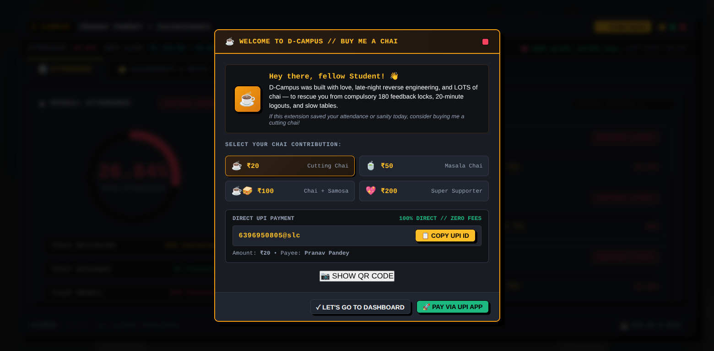

# ⚡ D-Campus — Modern Student Suite

[](https://developer.chrome.com/docs/extensions/mv3/)
[](#)
[](./ANALYSIS.md)
[](#-design-system)
[](./PRIVACY_POLICY.md)
[](LICENSE)

> A cyberpunk retro-dark augmentation suite for the student portal, transforming clunky legacy tables into a high-contrast, tactical dashboard with real-time academic synchronization, priority assignment queues, and single-click workflows.

<div align="center">
  
</div>

> [!TIP]
> **Technical Deep Dive:** Read our full engineering report on server bottlenecks, payload measurements, and balanced trade-offs:  
> 👉 **[Technical & Quantitative Impact Analysis (`ANALYSIS.md`)](./ANALYSIS.md)**

---

## 📸 Showcase & Visual Tour

### 1. Real-Time Attendance Gauge & Threshold Monitor
*Instant retro KPI radial gauge showing overall attendance percentage, safe (≥75%) vs. critical status, and the exact count of classes needed to reach eligibility or safe bunk allowance.*


---

### 2. Active Priority Assignments Queue
*Active assignments sorted with urgency priority (nearest due date first), overdue upload protections, subject filter chips, and instant Base64 spec downloads.*


---

### 3. Lecture Notes & Study Material Center
*Curated repository of 38+ faculty lecture notes, topic keywords, and direct download links — with clutter and deadline badges cleanly removed.*


---

### 4. Dynamic Monday–Friday Timetable Schedule
*Interactive weekly class schedule featuring real-time period status indicators (`COMPLETED`, `NOW RUNNING`, `UPCOMING`), next lecture ticker, and an in-card elective track switcher (GATE, CAT, Study Abroad, Competitive Coding).*


---

### 5. Irreversible Single-Submission Safety Shield
*Pre-flight verification modal with hazard stripes, assignment metadata review, file format validator (.pdf/.doc/.docx <5MB), and a mandatory confirmation lock to protect against irreversible portal uploads.*


---

### 6. Google Calendar / iCal (.ics) Timetable Sync
*One-click schedule exporter generating RFC 5545 compliant `.ics` calendar files with automatic 10-minute class alerts, embedded `Asia/Kolkata` timezone specifications, and 2-click synchronization with Google Calendar, Apple Calendar, and Outlook.*


---

### 7. 24/7 Session Keep-Alive Heartbeat & Toolbar HUD
*Continuous background sliding-window heartbeat preventing untimely portal logouts and eliminating annoying CAPTCHA prompts throughout the day, complete with real-time pulse feedback in both Popup and In-Page Overlay.*


---

### 8. "Buy me a Chai" Developer Support Modal
*Tactile, retro support dialog allowing students to support ongoing development via direct UPI payments or offline high-res QR code with zero external tracking.*


---

## 🌟 Core Capabilities

### 📊 1. Attendance Intelligence Module
- **Retro Radial KPI Gauge:** Live overall attendance calculation with visual color-coded thresholds (`≥75%` safe emerald vs. `<75%` danger rose).
- **Shortfall & Bunking Math Engine:** Automatically calculates consecutive classes required to reach 75% (`3T - 4P`) when in deficit, or exact safe bunk allowance (`floor((4P - 3T) / 3)`) when on track (≥75%) before falling below the exam eligibility threshold.
- **Subject-by-Subject Breakdown:** Searchable table with lecture deliveries, presences, percentages, and faculty details.

### 📁 2. Priority Assignment & Notes Hub
- **Urgency Sort Queue:** Automatically promotes active pending assignments due soonest to the top with warning badges (`⚡ DUE: <Date>`).
- **Overdue Guard:** Disables upload actions for closed assignments (`🔒 SUBMISSION CLOSED`) to prevent futile network requests.
- **Lecture Notes View:** Clean catalog of faculty course materials with `POSTED ON` dates and topic keywords.
- **Direct Spec Downloader:** Bypasses expired frontend checks to download assignment sheets directly via Base64 stream decoding.

### 📅 3. Dynamic Mon–Fri Timetable & Elective Selector
- **Scope-Aligned Calendar:** Scoped specifically to Monday–Friday following the university's academic week.
- **Dynamic Multi-Elective Dropdown:** Parses merged multi-track elective periods and provides an in-card switcher (GATE, CAT, Study Abroad, Competitive Coding, Project V, Internship) with persistent local memory.
- **Dynamic "Now & Next" Ticker:** Continuously tracks the currently running period and predicts the next upcoming class today or next weekday morning.

### 🔒 4. Zero-Config Multi-User Authentication
- **Session-Based Profile Resolution:** Automatically resolves student identity (`RegID`, `StudentID`, `StudentName`, `Branch`, `Year`) via session cookies without hardcoded IDs.
- **Account Switch Detection:** Automatically flushes stale caches and re-synchronizes when a different student logs in on the same workstation.
- **One-Click Auto-Login Engine:** Stores Student ID and Password securely in Chrome local storage, then auto-fills credentials, solves the CAPTCHA, and submits the form — completely hands-free.
- **Client-Side CAPTCHA Solver (Zero-External Dependencies):** Pure JavaScript OCR engine solving portal CAPTCHAs in <2ms directly in the browser with no network calls, no Python, no Selenium, and no third-party OCR APIs.
  - *Binary Luminance Thresholding:* Strips colored noise circles in O(n) via `(r < 85 && g < 85 && b < 85) ? 0 : 255`.
  - *8-Directional Connected-Component BFS:* Segmenting all 6 alphanumeric glyphs without external heuristics.
  - *Normalized 20×24 Bitmask IoU Matching:* 36 precompiled character templates matched via Intersection-over-Union with deterministic `'I'` stem detection by aspect ratio.

### 📅 5. Google Calendar / iCal (.ics) Timetable Sync
- **RFC 5545 iCalendar Engine:** Standalone client-side generator (`utils/calendar.js`) producing standard `.ics` calendar files with embedded `Asia/Kolkata` timezone specifications.
- **Automated 10-Minute Phone Alerts:** Every lecture includes `VALARM` triggers (`TRIGGER:-PT10M`) ensuring Google Calendar pushes automatic notifications to the student's mobile phone and university email before every class starts.
- **Semester Recurrence Rules:** Generates recurring weekly events (`RRULE:FREQ=WEEKLY;BYDAY=...`) automatically bounded by the academic semester end date.
- **1-Click Google Calendar Import:** Direct link to Google Calendar's import interface for 2-click desktop or mobile synchronization.

### 💓 6. 24/7 Session Keep-Alive Heartbeat (Anti-Logout Shield)
- **Sliding-Window Timeout Shield:** Reverse-engineers Microsoft IIS / ASP.NET MVC's sliding session expiration by automatically pinging `/Account/GetStudentDetail` every 5 minutes in the background, continuously resetting the 20-minute server timer.
- **Zero-CAPTCHA Workflow:** Keeps student sessions alive indefinitely across browser usage so they never get abruptly kicked out to the login page or forced to solve CAPTCHAs during study sessions.
- **Persistent MV3 Alarms:** Leverages `chrome.alarms` and `chrome.runtime.onStartup` to guarantee alarm health across browser reboots without battery or memory drain.
- **Live Pulse Feedback:** Features a visual retro heartbeat indicator (`💓 SESSION: ALIVE (5m) • Pulse #X`) on both Popup HUD and In-Page Overlay, with tactile click-to-pulse testing.
- **Assisted Login Autofocus:** Automatically detects browser-autofilled credentials on the login screen and shifts cursor focus instantly to the CAPTCHA entry box for frictionless 3-second logins.

### ☕ 7. "Buy me a Chai" Developer Support & Offline UPI Engine
- **First-Time Install Greeting:** Greets new users on fresh installation with an optional welcome modal explaining project motivations and key features.
- **Discrete & Unhighlighted Design:** Intentionally designed to avoid visual clutter — rests quietly as a subtle, dark tactile corner button in the full dashboard footer (`#btn-dashboard-corner-chai`) and bottom portal corner (`#coer-chai-corner-btn`) without distracting neon highlights or animations.
- **Seamless In-Dashboard Modal:** Opens the contribution modal cleanly over the full dashboard without closing or resetting the active view.
- **1-Click UPI & Offline QR Code:** Provides instant 1-click UPI copy (`6396950805@slc`) and toggleable offline QR code generated 100% on-device with zero external network requests.

---

## 📊 Quantitative Impact & Performance

For an in-depth, mathematically grounded analysis of how this extension reduces server bandwidth by **98.5%**, eliminates routine timetable requests for 1,000+ students, and compares legacy bottlenecks against local caching:

👉 **[Read the Full Technical & Quantitative Impact Analysis (`ANALYSIS.md`)](./ANALYSIS.md)**

| Dimension | Legacy Portal Workflow | D-Campus Suite | Measured Gain |
| :--- | :--- | :--- | :--- |
| **Payload Per Session** | ~2.4 MB (HTML + scripts + CSS) | ~36.6 KB JSON / **0 KB** (Cache) | **~98.5% Bandwidth Reduction** |
| **Schedule Lookups** | 20,000 weekly hits / 1,000 students | **0 requests** (Migrated to G-Cal) | **99.96% Server Offloading** |
| **Feedback Gate Delay** | 2.5 to 4 minutes active HTTP hold | **~450ms** single batch POST | **>80% Faster Connection Release** |
| **Query Latency** | 2,500ms – 8,000ms server roundtrips | **<50ms** local storage read | **Instantaneous UI Rendering** |

---

## 🛠️ Architecture & Tech Stack

```
extension/
├── manifest.json              # Chrome Manifest V3 configuration & scoped permissions
├── icons/                     # Neo-brutalist pixelated icons (16px, 48px, 128px)
├── utils/
│   ├── calendar.js            # RFC 5545 iCalendar (.ics) generator engine & scheduler
│   └── captcha_solver.js      # Client-side 0-network CAPTCHA OCR engine (IoU template matching)
├── background/
│   └── service-worker.js      # Background sync engine, alarms, cookie-authenticated fetchers
├── content/
│   ├── content.js             # Isolated Shadow DOM UI injection, auto-login workflow, modals
│   └── overlay.css            # Scoped retro-dark design system (zero leakage into native portal styles)
└── popup/
    ├── popup.html             # Compact toolbar HUD popup + Auto-Login credential card
    ├── popup.css              # HUD visual styling + credential toggle/inputs
    └── popup.js               # Toolbar live stats, quick sync dispatcher, credential persistence
```

* **Chrome Manifest V3:** Built entirely on modern V3 specifications with service worker lifecycle management and `chrome.storage.local`.
* **Zero-Leakage Shadow DOM:** The entire dashboard UI and retro style system are encapsulated inside an isolated Shadow Root (`#coer-retro-os-host`), ensuring zero styling conflicts with native portal styles.
* **Local-First & Offline Ready:** All academic records are cached locally on device for instant rendering without lag.

---

## 🎨 Design System

D-Campus adheres to a cohesive **Retro-Dark Neo-Brutalist** visual standard:

| Token | Hex Value | Role |
| :--- | :--- | :--- |
| `--bg-base` | `#0b0f19` | Deep space console background |
| `--bg-surface` | `#111827` | Panel card surface |
| `--accent-gold` | `#f59e0b` | Industrial amber: primary buttons, active alerts |
| `--accent-cyan` | `#06b6d4` | CRT Cyan: downloads, timetable cards |
| `--accent-emerald` | `#10b981` | Phosphor Green: safe attendance, success states |
| `--accent-rose` | `#f43f5e` | Hazard Red: critical attendance, closed submissions |
| `--accent-purple` | `#a855f7` | Synthwave Violet: study material tags |
| `--border-base` | `#374151` | Hard 1.5px structural borders |

*Design specifications feature 3px tactile retro button offsets, CRT amber highlights, and monospace data scales.*

---

## 📥 Installation

### Method A: Download Pre-Packaged Release (.ZIP) — Recommended
1. Download `d-campus-webstore-v1.4.0.zip` (or `d-campus-v1.4.0.zip`) from the [Latest Release](https://github.com/AkaPranav/D-Campus/releases/latest).
2. Extract the ZIP archive into a folder on your computer.
3. Open Google Chrome (or Brave, Edge, Arc, Opera) and navigate to `chrome://extensions`.
4. Enable the **Developer mode** toggle in the top-right corner.
5. Click **Load unpacked** and select the extracted folder (containing `manifest.json`).
6. Navigate to `https://erp.coeruniversity.in/` and log in. The **⚡ D-Campus** HUD launcher and toolbar extension will activate immediately!

### Method B: Clone from Source (Developer Mode)
1. Clone this repository:
   ```bash
   git clone https://github.com/AkaPranav/D-Campus.git
   cd D-Campus
   ```
2. Open Google Chrome and navigate to `chrome://extensions`.
3. Enable **Developer mode** toggle in the top-right corner.
4. Click **Load unpacked** and select the [`extension/`](./extension) folder.
5. Navigate to `https://erp.coeruniversity.in/` and log in. The **⚡ D-Campus** HUD launcher will appear automatically!

---

## 🔒 Privacy & Security

* **100% On-Device:** Zero data is sold, tracked, or transmitted to third-party servers.
* **Direct Communication:** All network requests travel directly between your local browser and `https://erp.coeruniversity.in/*`.
* **Zero Analytics:** Contains no Google Analytics, trackers, or advertising libraries.
* **Ephemeral Sessions:** Logging in as a different student immediately purges local caches and syncs the new account.

👉 **Read our comprehensive [Privacy Policy (`PRIVACY_POLICY.md`)](./PRIVACY_POLICY.md)** for detailed data handling disclosures and single-purpose specifications.

---

## ☕ Support the Developer ("Buy me a Chai")

D-Campus was built with late-night reverse engineering, passion for tactile UI, and lots of chai — designed to rescue students from 180-feedback lockout gates, 20-minute IIS session timeouts, and clunky legacy tables.

If this extension made your academic semester smoother, consider fueling ongoing updates with a cutting chai!

* **UPI ID:** `6396950805@slc`
* **Payee Name:** Pranav Pandey
* **Direct Access:** Click the subtle, unhighlighted **☕ Buy me a Chai** button located in the dashboard footer or extension popup to copy the UPI ID or scan the offline QR code.
* **100% On-Device:** Zero telemetry, zero payment SDKs, and 100% offline local QR rendering.

---

## 📜 License & Disclaimer
 
*Disclaimer: D-Campus is an independent student project developed to augment usability. It is not officially affiliated with or endorsed by COER University.*

